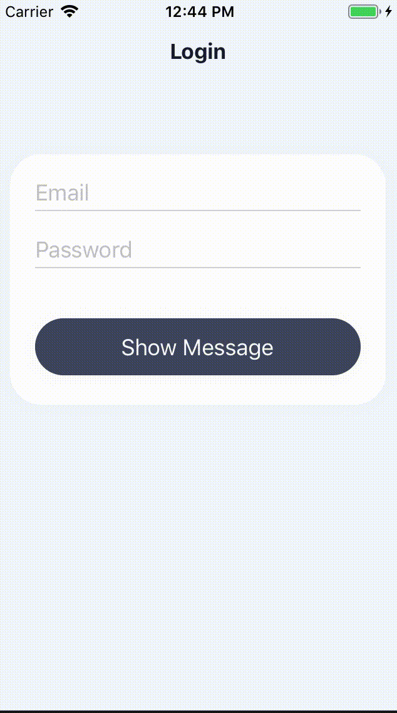

# react-native-message-dialog

A simple, dialog message component with callback action like Airbnb. Ideal for showing errors, info and warnings.




## Installation

If using npm:

```
npm i react-native-message-dialog
```

## Usage

```
import Message from 'react-native-message-dialog'
```

Simply place a `<Message />` inside of any compnent.

```
<View style={{ flex: 1 }}>
    <Message visible={true} />
</View>
```

### Styling Usage
Message is fully customizable using the `height, textStatus, textCb,  textMessage, textStatusStyle and textCbStyle` props.

Example usage to change dots color:

```
const textStatusStyle = {
    color: 'red',
};

return (
    <View style={{flex: 1}}>
        <Message visible={true} textStatusStyle={textStatusStyle} />
    </View>
)
```

## Documentation

### Message Component
| Name            | Description                                           | Default           | Type     |
|-----------------|-------------------------------------------------------|-------------------|----------|
| visible         | Determinates if message container is visible          | false             | Boolean  |
| onPress         | Callback to retry an action                           | () => ({})        | Function |
| textStatus      | Left text of the message container                    | Error             | String   |
| textCb          | Right text of the message container (Callback action) | Retry             | String   |
| textMessage     | Center text of the message container                  | Please try again. | String   |
| textStatusStyle | Style to apply to textMessage                         | Object            | Object   |
| textCbStyle     | Style to apply to textCb                              | Object            | Object   |

## Contributing
Pull requests are always welcome! Feel free to open a new GitHub issue for any changes that can be made.

## Author
Janid Ham | [https://janidham.com](https://janidham.com)

## License
[MIT](./LICENSE)
